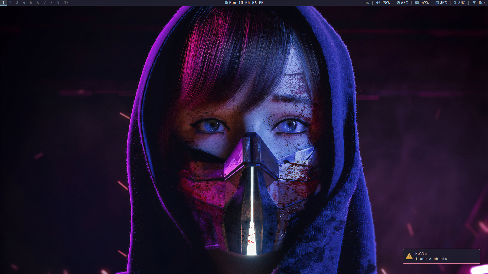
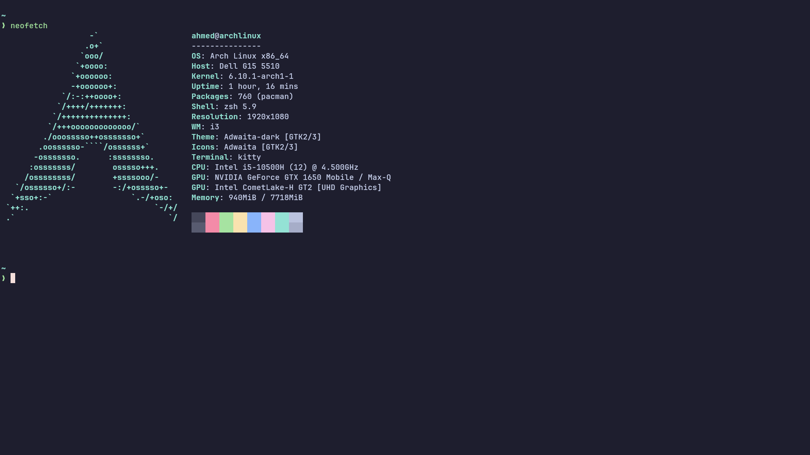
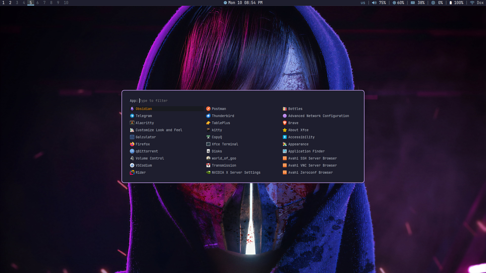
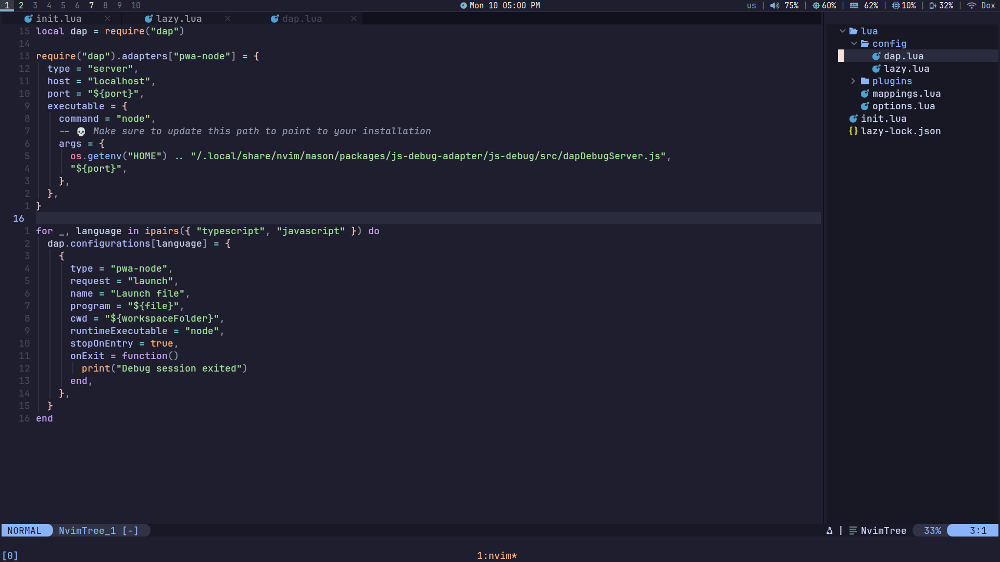

# dotfiles for my linux programs

### Programs

- OS : **Arch Linux**
- Shell: **zsh**
- Shell prompt: **starship**
- Terminal: **kitty + tmux**
- File manager: **thunar**
- Terminal file manager: **yazi**
- Wallpaper manager: **feh**
- WM : **bspwm**
- Browser: **Brave and Firefox**
- Bar : **polybar**
- App luancher: **rofi**
- notification: **dunst**
- GTK theme: **Dracula**
- Editor: **Neovim and VSCodium**
- Nerd font: **JetBrainsMono Nerd Font**

### Some stuff

- If the touchpad does ont work correctlly.

  add this to `/etc/X11/xorg.conf.d/00-keyboard.conf`

```conf
Section "InputClass"
    Identifier "touchpad"
    MatchIsTouchpad "on"
    Option "Tapping" "on"
    Option "TappingButtonMap" "lrm"
    Option "ClickMethod" "clickfinger"
    Option "TappingDrag" "true"
    Option "TappingDragLock" "true"
    Option "NaturalScrolling" "false"
    Option "DisableWhileTyping" "true"
EndSection
```

- To add arabic language.

  `sudo nvim /etc/locale.gen` and uncomment `ar_EG.UTF-8 UTF-8`

  `sudo locale-gen`

  add this to `/etc/X11/xorg.conf.d/00-keyboard.conf`

```conf
Section "InputClass"
        Identifier "system-keyboard"
        MatchIsKeyboard "on"
        Option "XkbLayout" "us,ara"
        Option "XkbModel" "pc105+inet"
        Option "XkbOptions" "grp:alt_shift_toggle"
EndSection
```

### Images









#### All my programs use the [catppuccin](https://github.com/catppuccin/catppuccin) theme.

#### I use [chezmoi](https://www.chezmoi.io/) to manage my dotfiles
